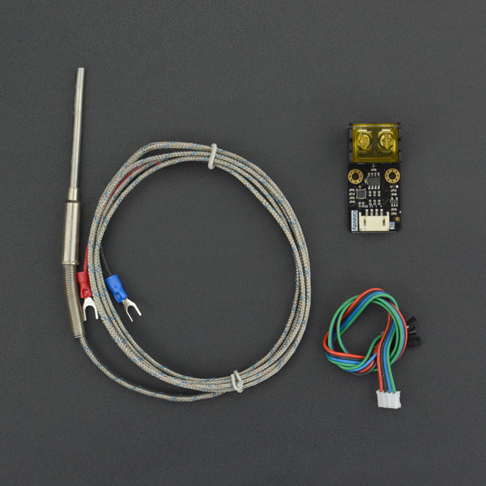

# DFRobot_MAX31855

- [中文版](./README_CN.md)

PT100 is suitable for most of the measurement of high temperature below 400℃, but usually the flame core temperature of domestic natural gas stove can reach more than 800℃, and the temperature of ceramic cellar or high-power electric furnace can even exceed 1000℃. In these ultra-high temperature scenarios, type K thermocouple is needed.  



## Product Link(https://www.dfrobot.com/product-1753.html)

SKU：SEN0558

## Table of Contents

* [Summary](#summary)
* [Installation](#installation)
* [Methods](#methods)
* [Compatibility](#compatibility)
* [History](#history)
* [Credits](#credits)

## Summary

A library to get probe temperature

## Installation

To use the library, first download it to Raspberry Pi, then open the routines folder.  To execute a routine read_temp.py, type Python read_temp.py on the command line.  

## Methods

```python

  '''
    @brief Read temperature data of probe
    @return Temperature value
  '''
  def read_celsius(self):

  '''
    @brief read the data from the register
    @param reg register address
    @param length read data length
  '''  
  def read_data(self, reg ,length):

```

## Compatibility

| Mainboard         | Pass | Miss | No Test | Note |
| ------------ | :--: | :----: | :----: | :--: |
| RaspberryPi2 |      |        |   √    |      |
| RaspberryPi3 |      |        |   √    |      |
| RaspberryPi4 |  √   |        |        |      |

* Python Version

| Python  | Pass | Miss | No Test | Note |
| ------- | :--: | :----: | :----: | ---- |
| Python2 |  √   |        |        |      |
| Python3 |  √   |        |        |      |

## History

- 2022/4/1 - Version 1.0.0 released

## Credits

Written by PengKaixing(kaixing.peng@dfrobot.com), 2021. (Welcome to our [website](https://www.dfrobot.com/))